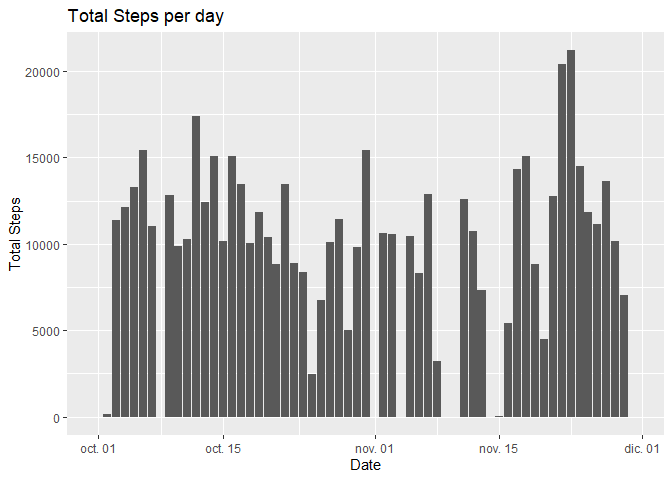
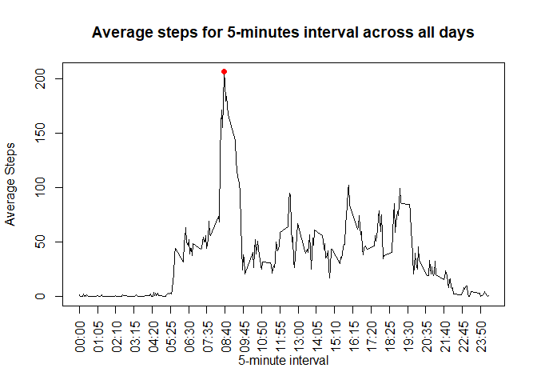
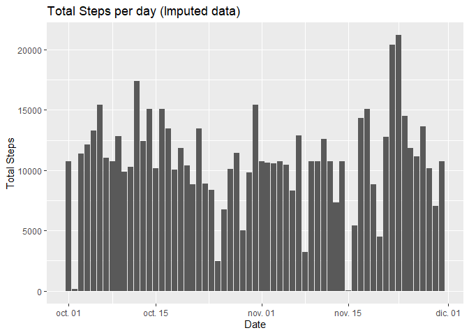
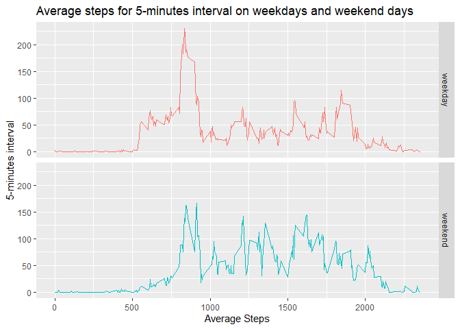

by Gabriel Espinosa

## Loading and preprocessing the data

First, load the libraries and data in the environment. The code changes the column date from char to Date type.


```r
library(plyr)
library(dplyr)
library(ggplot2)
library(lubridate)
```


```r
activity <- read.csv(unzip("activity.zip"))
activity$date <- as.Date(activity$date)
str(activity)
```

```
## 'data.frame':	17568 obs. of  3 variables:
##  $ steps   : int  NA NA NA NA NA NA NA NA NA NA ...
##  $ date    : Date, format: "2012-10-01" "2012-10-01" ...
##  $ interval: int  0 5 10 15 20 25 30 35 40 45 ...
```


## What is mean total number of steps taken per day?

First, the total Steps per day are reported. Then, it generates the **histogram** which shows the total Steps per day.


```r
with(activity,tapply(steps, date, sum, na.rm = TRUE))
```

```
## 2012-10-01 2012-10-02 2012-10-03 2012-10-04 2012-10-05 2012-10-06 2012-10-07 
##          0        126      11352      12116      13294      15420      11015 
## 2012-10-08 2012-10-09 2012-10-10 2012-10-11 2012-10-12 2012-10-13 2012-10-14 
##          0      12811       9900      10304      17382      12426      15098 
## 2012-10-15 2012-10-16 2012-10-17 2012-10-18 2012-10-19 2012-10-20 2012-10-21 
##      10139      15084      13452      10056      11829      10395       8821 
## 2012-10-22 2012-10-23 2012-10-24 2012-10-25 2012-10-26 2012-10-27 2012-10-28 
##      13460       8918       8355       2492       6778      10119      11458 
## 2012-10-29 2012-10-30 2012-10-31 2012-11-01 2012-11-02 2012-11-03 2012-11-04 
##       5018       9819      15414          0      10600      10571          0 
## 2012-11-05 2012-11-06 2012-11-07 2012-11-08 2012-11-09 2012-11-10 2012-11-11 
##      10439       8334      12883       3219          0          0      12608 
## 2012-11-12 2012-11-13 2012-11-14 2012-11-15 2012-11-16 2012-11-17 2012-11-18 
##      10765       7336          0         41       5441      14339      15110 
## 2012-11-19 2012-11-20 2012-11-21 2012-11-22 2012-11-23 2012-11-24 2012-11-25 
##       8841       4472      12787      20427      21194      14478      11834 
## 2012-11-26 2012-11-27 2012-11-28 2012-11-29 2012-11-30 
##      11162      13646      10183       7047          0
```

```r
actDay <- activity %>% group_by(date) %>% summarise(totalsteps = sum(steps,na.rm = TRUE))
actDay$date <- as.Date(actDay$date)
ggplot(actDay,aes(date,totalsteps)) + geom_histogram(stat="identity")
```

```
## Warning: Ignoring unknown parameters: binwidth, bins, pad
```

<!-- -->

```r
# Faltan labels.
```


Now, it calculates the **mean** and **median** of the total Steps per day.


```r
activity %>% group_by(date) %>% summarise(meanSteps = mean(steps,na.rm = TRUE), medianSteps = median(steps, na.rm = TRUE))
```

```
## # A tibble: 61 x 3
##    date       meanSteps medianSteps
##    <date>         <dbl>       <dbl>
##  1 2012-10-01   NaN              NA
##  2 2012-10-02     0.438           0
##  3 2012-10-03    39.4             0
##  4 2012-10-04    42.1             0
##  5 2012-10-05    46.2             0
##  6 2012-10-06    53.5             0
##  7 2012-10-07    38.2             0
##  8 2012-10-08   NaN              NA
##  9 2012-10-09    44.5             0
## 10 2012-10-10    34.4             0
## # ... with 51 more rows
```


## What is the average daily activity pattern?

Here, the code draws the plot of 5-min interval steps taken (x-axis) and average of the steps taken across all days.  
For the second part of the question, you can see the red point which indicates the 5-minutes interval with maximum (average) number of steps across all days.


```r
actInt <- activity %>% group_by(interval) %>% summarise(averageSteps = mean(steps,na.rm = TRUE))

with(actInt,plot(interval,averageSteps,type="l"))
with(actInt,points(interval[which.max(averageSteps)],max(averageSteps), col="red", pch = 19))
```

<!-- -->

```r
# Faltan labels
with(actInt,interval[which.max(averageSteps)])
```

```
## [1] 835
```


## Imputing missing values

First, the code reports the total number of missing values (**NA**) in the data set. We can see in the result, the 2304 **NA** are in the *steps* column.


```r
colSums(is.na(activity))
```

```
##    steps     date interval 
##     2304        0        0
```

For the second part, I decided to use the mean of the 5-min interval across all days (*actInt* data set) for imputing the data.  

Now, it creates a new data set with the imputed data, as specify before.


```r
actImput <- activity
actImput$steps <- replace(actImput$steps,is.na(actImput$steps),actInt$averageSteps)
actImput$steps <- sapply(actImput$steps,round)
str(actImput)
```

```
## 'data.frame':	17568 obs. of  3 variables:
##  $ steps   : num  2 0 0 0 0 2 1 1 0 1 ...
##  $ date    : Date, format: "2012-10-01" "2012-10-01" ...
##  $ interval: int  0 5 10 15 20 25 30 35 40 45 ...
```


It's time to draw an histogram of the new (**imput**) data set.


```r
actImputDay <- actImput %>% group_by(date) %>% summarise(totalSteps = sum(steps,na.rm = TRUE))
actImputDay$date <- as.Date(actImputDay$date)
ggplot(actImputDay,aes(date,totalSteps)) + geom_histogram(stat="identity")
```

```
## Warning: Ignoring unknown parameters: binwidth, bins, pad
```

<!-- -->

```r
# Faltan labels.

actImput %>% group_by(date) %>% summarise(meanSteps = mean(steps), medianSteps = median(steps))
```

```
## # A tibble: 61 x 3
##    date       meanSteps medianSteps
##    <date>         <dbl>       <dbl>
##  1 2012-10-01    37.4          34.5
##  2 2012-10-02     0.438         0  
##  3 2012-10-03    39.4           0  
##  4 2012-10-04    42.1           0  
##  5 2012-10-05    46.2           0  
##  6 2012-10-06    53.5           0  
##  7 2012-10-07    38.2           0  
##  8 2012-10-08    37.4          34.5
##  9 2012-10-09    44.5           0  
## 10 2012-10-10    34.4           0  
## # ... with 51 more rows
```


As it shows in this results, the results really change for the days with **NaN mean**, thats because all the intervals that day are **NA**. With this imputing "technic", it's obviuos because I decided to round the values to a integer, i.e. the NA's in interval 0 (*00:00*) change to 2 steps, rounded from 1.7169.


## Are there differences in activity patterns between weekdays and weekends?

For the last question, the next code creates a new column (variable) with two factors: *weekday* or *weekend*, this indicates that the date is in a "weekday" day or "weekend" day. 


```r
actWday <- actImput %>% mutate(weekday = ifelse(wday(date, week_start = TRUE) %in% 1:5, "weekday","weekend"))
actWday$weekday <- as.factor(actWday$weekday)
str(actWday)
```

```
## 'data.frame':	17568 obs. of  4 variables:
##  $ steps   : num  2 0 0 0 0 2 1 1 0 1 ...
##  $ date    : Date, format: "2012-10-01" "2012-10-01" ...
##  $ interval: int  0 5 10 15 20 25 30 35 40 45 ...
##  $ weekday : Factor w/ 2 levels "weekday","weekend": 1 1 1 1 1 1 1 1 1 1 ...
```


Finally, a line plot with the two factors, wih 5-min interval steps taken (x-axis) versus average of the steps taken across all days, of course, for each factor (*weekday/weekend days*).


```r
actWdayInt <- actWday %>% group_by(interval, weekday) %>% summarise(averageSteps = mean(steps,na.rm = TRUE))

ggplot(actWdayInt,aes(interval,averageSteps)) + facet_grid(weekday~.) + geom_line()
```

<!-- -->

Thanks for your attention.

